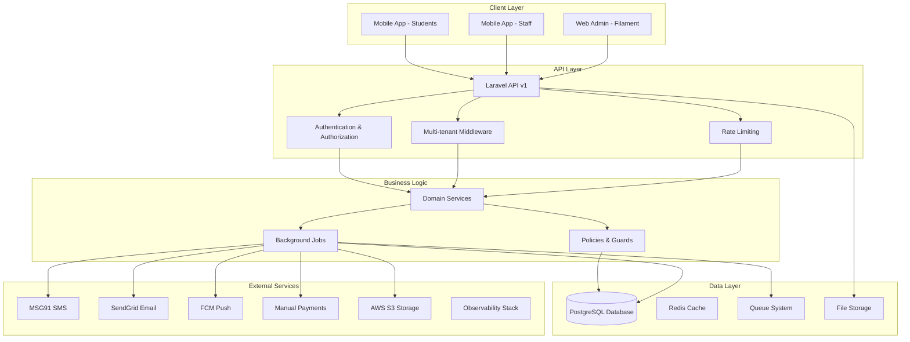
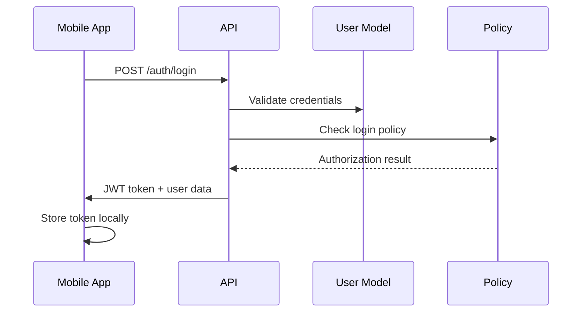
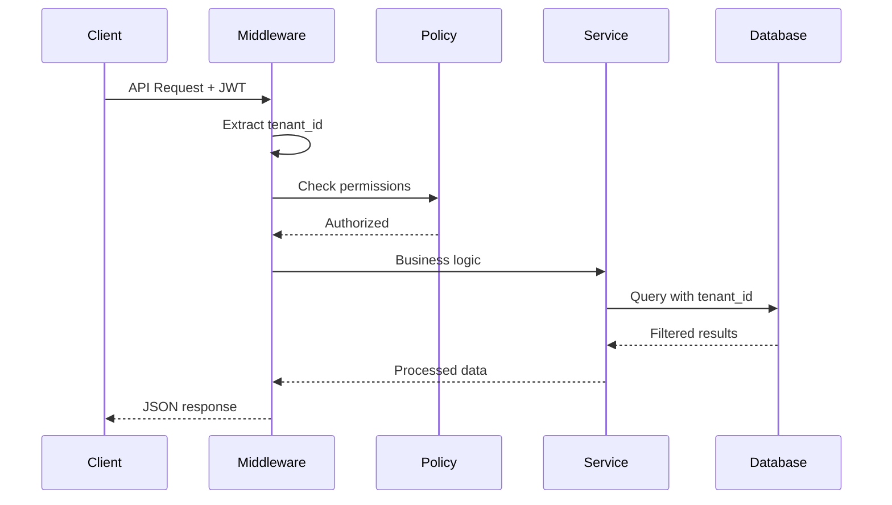
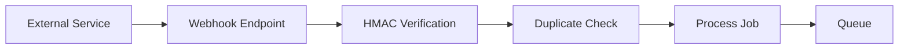

# MAP-HMS Architecture Overview

High-level system architecture and component relationships for the MAP-HMS multi-tenant hostel management system.

## System Architecture



## Multi-Tenant Architecture

MAP-HMS implements a **multi-tenant architecture** with the following hierarchy:

```
Tenant (University/Organization)
├── Campus (Physical location)
    ├── Hostel (Residence building)
        ├── Room Block (Floor/Section)
            ├── Room (Individual space)
                ├── Bed (Student allocation)
```

### Tenant Isolation

- **Database Level**: All business tables include `tenant_id`
- **Application Level**: Global scopes enforce tenant isolation
- **Policy Level**: Authorization policies check tenant membership
- **API Level**: Middleware validates tenant access

All functional modules (Security/Gate, Laundry, Sports) are enabled for every tenant; there are no runtime feature toggles in v1.

## Core Components

### 1. Laravel API (`/api`)

**Framework**: Laravel 11 with PHP 8.2+

**Key Features**:
- RESTful API with OpenAPI documentation
- Multi-tenant data isolation
- Role-based access control (RBAC)
- Queue-based background processing
- Comprehensive audit logging

**Directory Structure**:
```
app/
├── Domain/          # Business logic modules
├── Http/            # Controllers, Requests, Resources
├── Models/          # Eloquent models
├── Policies/        # Authorization policies
├── Jobs/            # Background jobs
├── Services/        # Business services
├── Filament/        # Admin panel resources
└── Support/         # Utilities and helpers
```

### 2. Filament Admin Panel

**Framework**: Filament v3

**Features**:
- Multi-panel architecture (Campus Manager, Rector, etc.)
- Real-time dashboards and widgets
- Bulk operations and exports
- Role-based UI customization
- Advanced filtering and search

### 3. React Native Mobile Apps

**Framework**: React Native with TypeScript

**Two App Variants**:
- **Student App**: Out-pass requests, notices, tickets, payments view
- **Staff App**: Campus Manager, Rector, Warden, Guard, HK/RM supervisors, Laundry, Sports

**Key Features**:
- Online-first UX with clear “Connection lost. Retry.” banner when offline
- Zustand state management
- React Hook Form with Zod validation
- Push notifications (FCM)
- Secure local storage via MMKV + Keychain-derived key

## Data Flow Patterns

### 1. Authentication Flow



### 2. Multi-Tenant Request Flow



### 3. Connectivity Handling

Mobile apps are online-first. When connectivity drops the UI displays a blocking banner with a Retry action; no background queue is maintained. Guards can still log Emergency Exits manually and sync once network returns.

## Security Architecture

### Authentication & Authorization

- **JWT Tokens**: Stateless authentication
- **Laravel Sanctum**: Token management
- **Spatie Permissions**: Role-based access control
- **Policy-based Authorization**: Granular permissions
- **Step-up OTP**: Required for tenant activation/rollback, Rector approvals, sensitive exports, and manual payment edits

### Data Protection

- **Tenant Isolation**: Database-level separation
- **PII Encryption**: Guardian contacts, medical notes, staff phone numbers, and addresses encrypted at rest
- **Audit Logging**: Comprehensive activity tracking
- **Input Validation**: Strict request validation

### API Security

- **Rate Limiting**: Per-tenant and per-user limits
- **CORS Configuration**: Controlled cross-origin access
- **Request Validation**: RFC7807 error responses
- **HMAC Verification**: Webhook signature validation

## Integration Architecture

### External Services

| Service | Purpose | Integration Method |
|---------|---------|-------------------|
| **MSG91** | SMS notifications | REST API with DLT |
| **SendGrid** | Email notifications | REST API with templates |
| **FCM** | Push notifications | REST API with topics |
| **Manual Payments** | Payment tracking | Direct database updates |
| **AWS S3** | File storage | Presigned URLs |

### Webhook Handling



## Performance Considerations

### Database Optimization

- **Indexing Strategy**: Tenant-scoped indexes
- **Query Optimization**: Eager loading, N+1 prevention
- **Connection Pooling**: Efficient database connections

### Caching Strategy

- **Redis Cache**: Session storage, per-tenant throttles, job coordination
- **Application Cache**: Computed values, API responses
- **CDN**: Static asset delivery

### Mobile Optimization

- **Connection Handling**: Immediate feedback on connectivity loss with retry loops
- **Image Optimization**: Compressed uploads
- **Lightweight State**: Minimal cached data, refreshed per screen

## Deployment Architecture

### Development Environment

- **Local Development**: Laravel Valet or Docker
- **Database**: PostgreSQL (shared schema) to mirror production
- **Queue**: Redis or sync driver for unit tests

### Production Environment

- **Web Server**: Nginx with PHP-FPM
- **Database**: PostgreSQL with read replicas
- **Queue**: Redis with Horizon monitoring
- **Storage**: AWS S3 with CloudFront CDN
- **Monitoring**: Sentry error tracking + CloudWatch alarms on health checks and queue lag

## Monitoring & Observability

### Application Monitoring

- **Error Tracking**: Sentry integration
- **Performance Metrics**: Laravel Telescope (dev)
- **Queue Monitoring**: Laravel Horizon
- **Audit Logs**: Comprehensive activity tracking
- **Health Checks**: `/v1/central-healthz` and tenant `/v1/healthz` verify HTTP, Postgres, Redis, queue worker, and S3 connectivity; failures trigger alerts.

### Business Metrics

- **Dashboard Widgets**: Real-time KPIs
- **Export Reports**: CSV/Excel downloads
- **Analytics Integration**: Segment.com (mobile)

## Conflict Resolution & Tenant Management

### Super Admin Conflict Resolution

When conflicts arise between Campus Manager and Rector decisions:

1. **Escalation Matrix**:
   - Campus Manager reports issue to Rector
   - Rector reviews within 24 hours
   - If unresolved, Super Admin mediates
   - Super Admin decision is final

2. **Rollback Procedures**:
   - Tenant activation can be rolled back within 24 hours
   - Requires Super Admin approval and step-up OTP
   - Automatically archives created data
   - Logs rollback event for audit

3. **Configuration Tracking**:
   - Tenant configurations versioned in `tenant.data` JSON
   - No runtime feature flags; any structural change requires PRD update
   - Super Admin approves curfew/visiting hour edits via audit trail

### Tenant Management SOPs

1. **Onboarding Process**:
   - Draft → Provisioning → Ready Check → Activation
   - Idempotent operations prevent duplicates
   - Pre-flight checks validate configuration

2. **Data Isolation**:
   - Single shared PostgreSQL database
   - Row Level Security (RLS) enforces tenant boundaries
   - Global scopes prevent cross-tenant queries
   - All queries filtered by `tenant_id`

3. **Security Controls**:
   - Per-device token limits (max 5)
   - Step-up OTP for sensitive operations
   - PII encryption and audit logging
   - Secure key derivation for storage

4. **Monitoring & Alerting**:
   - Sentry for error tracking
   - Horizon for queue monitoring
   - Structured logging with tenant context
   - Alert thresholds for isolation breaches

---

*Architecture version: v1.1*
*Owner: MAP Co-Pilot*
