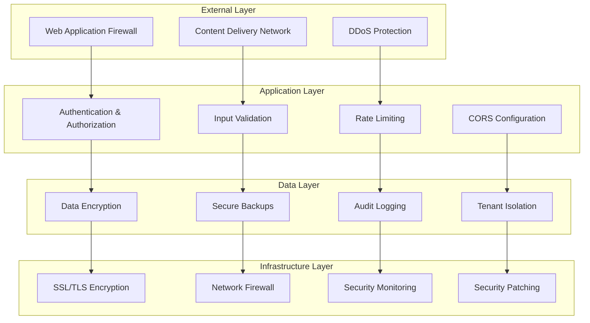

# MAP-HMS Security Practices

Comprehensive security guidelines and practices for MAP-HMS development.

## Security Architecture Overview

MAP-HMS implements a defense-in-depth security strategy with multiple layers of protection:



## Authentication & Authorization

### JWT Token Security
```php
/**
 * JWT Token Configuration
 * @security: Token expiration, secure storage, refresh mechanism
 */

// Sanctum configuration
'sanctum' => [
    'expiration' => 60 * 24, // 24 hours
    'token_prefix' => env('SANCTUM_TOKEN_PREFIX', ''),
],

// Token creation with device tracking
$token = $user->createToken($deviceName, ['*'], now()->addDay());
```

### Multi-Factor Authentication
```php
// OTP verification for sensitive operations
class OtpVerifier
{
    public function verify(string $phone, string $otp): bool
    {
        // @security: Rate limit OTP attempts
        $key = "otp_attempts:{$phone}";
        $attempts = Cache::get($key, 0);
        
        if ($attempts >= 5) {
            throw new TooManyOtpAttemptsException();
        }
        
        // Verify OTP with MSG91
        $isValid = $this->msg91Service->verifyOtp($phone, $otp);
        
        if (!$isValid) {
            Cache::increment($key, 1);
            Cache::expire($key, 300); // 5 minutes
        }
        
        return $isValid;
    }
}
```

### Role-Based Access Control
```php
// Spatie permissions configuration
'permission' => [
    'models' => [
        'permission' => Spatie\Permission\Models\Permission::class,
        'role' => Spatie\Permission\Models\Role::class,
    ],
    'table_names' => [
        'roles' => 'roles',
        'permissions' => 'permissions',
        'model_has_permissions' => 'model_has_permissions',
        'model_has_roles' => 'model_has_roles',
        'role_has_permissions' => 'role_has_permissions',
    ],
],

// Policy example with tenant isolation
class OutPassPolicy
{
    public function view(User $user, OutPass $outPass): bool
    {
        // @security: Tenant isolation check
        return $user->tenant_id === $outPass->tenant_id &&
               $user->can('view_outpasses');
    }
    
    public function approve(User $user, OutPass $outPass): bool
    {
        // @security: Role and scope validation
        return $user->tenant_id === $outPass->tenant_id &&
               $user->hasRole('campus_manager') &&
               $user->can('approve_outpasses') &&
               $this->isInUserScope($user, $outPass->hostel_id);
    }
}
```

## Data Protection

### PII Encryption
```php
// Encrypt sensitive data at rest
class Student extends Model
{
    protected $casts = [
        'phone' => 'encrypted',
        'address' => 'encrypted',
        'emergency_contact' => 'encrypted',
    ];
    
    // @security: Automatic encryption/decryption
    public function getPhoneAttribute($value)
    {
        return $this->encrypt($value);
    }
    
    public function setPhoneAttribute($value)
    {
        $this->attributes['phone'] = $this->decrypt($value);
    }
}
```

### Database Security
```php
// Global tenant scope for data isolation
class TenantScope implements Scope
{
    public function apply(Builder $builder, Model $model)
    {
        // @security: Automatic tenant filtering
        $builder->where($model->getTable() . '.tenant_id', auth()->user()?->tenant_id);
    }
}

// Secure file upload with validation
class FileUploadService
{
    public function uploadFile(UploadedFile $file): string
    {
        // @security: File type validation
        $allowedTypes = ['image/jpeg', 'image/png', 'application/pdf'];
        if (!in_array($file->getMimeType(), $allowedTypes)) {
            throw new InvalidFileTypeException();
        }
        
        // @security: File size limits
        if ($file->getSize() > 5 * 1024 * 1024) { // 5MB
            throw new FileTooLargeException();
        }
        
        // @security: Generate secure filename
        $filename = Str::uuid() . '.' . $file->getClientOriginalExtension();
        
        // @security: Upload to S3 with presigned URL
        return $this->s3Service->upload($file, $filename);
    }
}
```

### Audit Logging
```php
// Comprehensive audit logging
class AuditLogger
{
    public function log(string $action, Model $model, array $data = []): void
    {
        // @security: Log all sensitive operations
        AuditLog::create([
            'user_id' => auth()->id(),
            'tenant_id' => auth()->user()?->tenant_id,
            'action' => $action,
            'model_type' => get_class($model),
            'model_id' => $model->id,
            'data' => $this->sanitizeData($data),
            'ip_address' => request()->ip(),
            'user_agent' => request()->userAgent(),
            'created_at' => now(),
        ]);
    }
    
    private function sanitizeData(array $data): array
    {
        // @security: Remove sensitive data from logs
        $sensitiveFields = ['password', 'otp', 'token', 'ssn'];
        
        return array_filter($data, function ($key) use ($sensitiveFields) {
            return !in_array($key, $sensitiveFields);
        }, ARRAY_FILTER_USE_KEY);
    }
}
```

## API Security

### Input Validation
```php
// Strict request validation
class StoreOutPassRequest extends FormRequest
{
    public function rules(): array
    {
        return [
            'reason' => ['required', 'string', 'min:10', 'max:500'],
            'requested_at' => ['required', 'date', 'after:now'],
            'valid_until' => ['required', 'date', 'after:requested_at'],
            'type' => ['required', 'in:emergency,planned,medical'],
        ];
    }
    
    public function messages(): array
    {
        return [
            'reason.min' => 'Reason must be at least 10 characters',
            'requested_at.after' => 'Request time must be in the future',
            'valid_until.after' => 'Valid until must be after request time',
        ];
    }
}
```

### Rate Limiting
```php
// API rate limiting configuration
'api' => [
    'throttle' => [
        'enabled' => true,
        'limit' => 60, // requests per minute
        'decay' => 60, // decay time in seconds
    ],
],

// Custom rate limiting for sensitive endpoints
Route::middleware(['throttle:otp:5,1'])->group(function () {
    Route::post('/auth/verify-otp', [AuthController::class, 'verifyOtp']);
});

// Rate limiting with tenant isolation
class TenantRateLimiter
{
    public function check(string $tenantId, string $action): bool
    {
        $key = "rate_limit:{$tenantId}:{$action}";
        $attempts = Cache::get($key, 0);
        
        if ($attempts >= $this->getLimit($action)) {
            return false;
        }
        
        Cache::increment($key, 1);
        Cache::expire($key, $this->getDecay($action));
        
        return true;
    }
}
```

### CORS Configuration
```php
// Secure CORS configuration
'cors' => [
    'paths' => ['api/*', 'sanctum/csrf-cookie'],
    'allowed_methods' => ['*'],
    'allowed_origins' => [
        'http://localhost:3000',
        'https://admin.map-hms.com',
        'https://mobile.map-hms.com',
    ],
    'allowed_origins_patterns' => [],
    'allowed_headers' => ['*'],
    'exposed_headers' => [],
    'max_age' => 0,
    'supports_credentials' => true,
],
```

### Controlled Production API Access (Demo Builds)

To support internal and client-facing demos that require full production parity for the staff app, we permit limited use of production APIs against the AWS-hosted sample dataset under the following guarded workflow:

1. **Scope**
   - Access is restricted to the read-only `demo` tenant seeded via the Production India dataset.
   - Only demo/sandbox feature flags may be enabled; live payment/SMS integrations remain disabled.
2. **Approvals**
   - Product Owner (or delegate) authorizes the demo scenario and target tenant.
   - Security Lead reviews the request for data-exposure risk and records the decision in the security change log.
3. **Credentials**
   - Generate time-bound demo credentials through Vault (or equivalent secret manager) with the `demo` tenant scope.
   - Share credentials out-of-band; embed clear expiry (default 14 days) and revocation procedure.
4. **Controls**
   - Enable API rate limits suitable for demo loads and monitor via SecurityMonitor.
   - Ensure all interactions are captured in `AUDIT_LOG` and tagged with `context=demo`.
   - Client builds must ship with certificate pinning and disable data export endpoints.
5. **Review & Revocation**
   - Review access after expiry or demo completion; rotate credentials immediately.
   - Capture a post-demo security note summarizing usage, issues, and revocation confirmation.

Any request that exceeds these guardrails (e.g., full-tenant production data or long-lived credentials) must escalate to the full security/privacy approval process defined in SecurityPlan MASVS controls.

## Webhook Security

### HMAC Verification
```php
// Webhook signature verification
class WebhookVerifier
{
    public function verify(string $payload, string $signature, string $secret): bool
    {
        // @security: HMAC signature verification
        $expectedSignature = hash_hmac('sha256', $payload, $secret);
        
        return hash_equals($expectedSignature, $signature);
    }
}

// Razorpay webhook handling
class RazorpayWebhookHandler
{
    public function handle(Request $request): JsonResponse
    {
        // @security: Verify webhook signature
        $signature = $request->header('X-Razorpay-Signature');
        $payload = $request->getContent();
        
        if (!$this->webhookVerifier->verify($payload, $signature, config('services.razorpay.webhook_secret'))) {
            return response()->json(['error' => 'Invalid signature'], 401);
        }
        
        // @security: Check for duplicate events
        $eventId = $request->input('event_id');
        if (WebhookLog::where('event_id', $eventId)->exists()) {
            return response()->json(['status' => 'duplicate'], 200);
        }
        
        // Process webhook
        WebhookLog::create(['event_id' => $eventId, 'processed' => true]);
        
        return response()->json(['status' => 'success']);
    }
}
```

## Mobile App Security

### Secure Storage
```typescript
// Secure token storage
import AsyncStorage from '@react-native-async-storage/async-storage';
import { MMKV } from 'react-native-mmkv';

const secureStorage = new MMKV({
  id: 'map-hms-secure',
  encryptionKey: 'your-encryption-key'
});

// Store JWT token securely
const storeToken = async (token: string) => {
  try {
    secureStorage.set('auth_token', token);
  } catch (error) {
    console.error('Failed to store token:', error);
  }
};

// Retrieve token securely
const getToken = (): string | undefined => {
  try {
    return secureStorage.getString('auth_token');
  } catch (error) {
    console.error('Failed to retrieve token:', error);
    return undefined;
  }
};
```

### Screenshot Protection
```typescript
// Prevent screenshots on sensitive screens
import { preventScreenshot, allowScreenshot } from 'react-native-screenshot-prevent';

const SensitiveScreen = () => {
  useEffect(() => {
    // @security: Prevent screenshots
    preventScreenshot();
    
    return () => {
      allowScreenshot();
    };
  }, []);
  
  return (
    <View>
      {/* Sensitive content */}
    </View>
  );
};
```

### Certificate Pinning
```typescript
// SSL certificate pinning for API calls
import { NetworkingModule } from 'react-native';

const apiClient = axios.create({
  baseURL: Config.API_BASE,
  timeout: 10000,
});

// @security: Certificate pinning
apiClient.interceptors.request.use((config) => {
  if (Platform.OS === 'ios') {
    // iOS certificate pinning
    config.certificatePinning = {
      hostname: 'api.map-hms.com',
      certificates: ['certificate-hash'],
    };
  }
  
  return config;
});
```

## Compliance & Monitoring

### Data Retention
```php
// Automatic data retention policies
class DataRetentionService
{
    public function cleanupExpiredData(): void
    {
        // @security: Delete expired audit logs
        AuditLog::where('created_at', '<', now()->subYears(7))->delete();
        
        // @security: Archive old outpasses
        OutPass::where('created_at', '<', now()->subYears(2))
               ->update(['archived' => true]);
        
        // @security: Cleanup temporary files
        Storage::disk('temp')->delete(Storage::disk('temp')->files());
    }
}
```

### Security Monitoring
```php
// Security event monitoring
class SecurityMonitor
{
    public function logSecurityEvent(string $event, array $context = []): void
    {
        // @security: Log security events
        Log::channel('security')->warning($event, [
            'user_id' => auth()->id(),
            'tenant_id' => auth()->user()?->tenant_id,
            'ip_address' => request()->ip(),
            'user_agent' => request()->userAgent(),
            'context' => $context,
            'timestamp' => now(),
        ]);
        
        // @security: Send alerts for critical events
        if ($this->isCriticalEvent($event)) {
            $this->sendSecurityAlert($event, $context);
        }
    }
    
    private function isCriticalEvent(string $event): bool
    {
        $criticalEvents = [
            'failed_login_attempts',
            'unauthorized_access',
            'data_breach_attempt',
            'suspicious_activity',
        ];
        
        return in_array($event, $criticalEvents);
    }
}
```

## Security Testing

### Security Test Examples
```php
// Test tenant isolation
test('user cannot access other tenant data', function () {
    $tenant1 = Tenant::factory()->create();
    $tenant2 = Tenant::factory()->create();
    
    $user1 = User::factory()->for($tenant1)->create();
    $outpass2 = OutPass::factory()->for($tenant2)->create();
    
    $this->actingAs($user1)
        ->getJson("/api/v1/outpasses/{$outpass2->id}")
        ->assertForbidden();
});

// Test rate limiting
test('api rate limiting works', function () {
    $user = User::factory()->create();
    
    // Make requests up to the limit
    for ($i = 0; $i < 60; $i++) {
        $this->actingAs($user)
            ->getJson('/api/v1/outpasses')
            ->assertOk();
    }
    
    // Next request should be rate limited
    $this->actingAs($user)
        ->getJson('/api/v1/outpasses')
        ->assertStatus(429);
});

// Test input validation
test('malicious input is rejected', function () {
    $user = User::factory()->create();
    
    $maliciousData = [
        'reason' => '<script>alert("xss")</script>',
        'requested_at' => 'invalid-date',
    ];
    
    $this->actingAs($user)
        ->postJson('/api/v1/outpasses', $maliciousData)
        ->assertStatus(422)
        ->assertJsonValidationErrors(['reason', 'requested_at']);
});
```

## Security Checklist

### Development Security Checklist
- [ ] All inputs validated and sanitized
- [ ] SQL injection prevention (use Eloquent/Query Builder)
- [ ] XSS prevention (escape output, CSP headers)
- [ ] CSRF protection enabled
- [ ] Authentication required for all endpoints
- [ ] Authorization policies implemented
- [ ] Tenant isolation enforced
- [ ] Sensitive data encrypted
- [ ] Audit logging implemented
- [ ] Rate limiting configured
- [ ] Secure file upload validation
- [ ] Webhook signature verification
- [ ] Error messages don't leak information
- [ ] Security headers configured
- [ ] Dependencies regularly updated

### Deployment Security Checklist
- [ ] Environment variables secured
- [ ] Database credentials rotated
- [ ] SSL/TLS certificates valid
- [ ] Firewall rules configured
- [ ] Intrusion detection enabled
- [ ] Backup encryption enabled
- [ ] Access logs monitored
- [ ] Security updates applied
- [ ] Penetration testing completed
- [ ] Incident response plan ready

---

*Security practices version: v1.0*
*Owner: MAP Co-Pilot*
